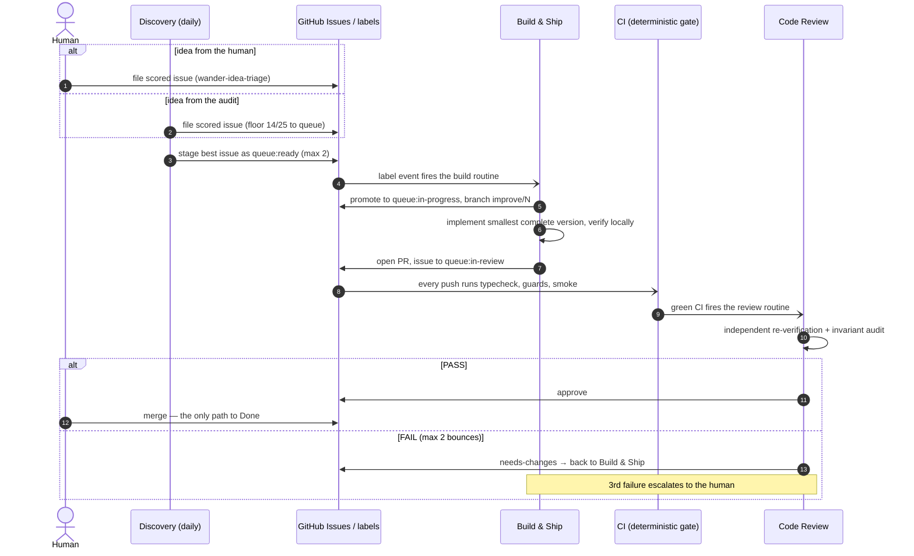
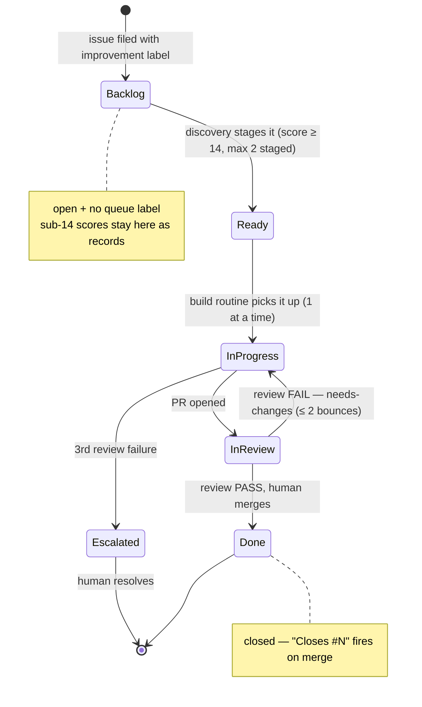
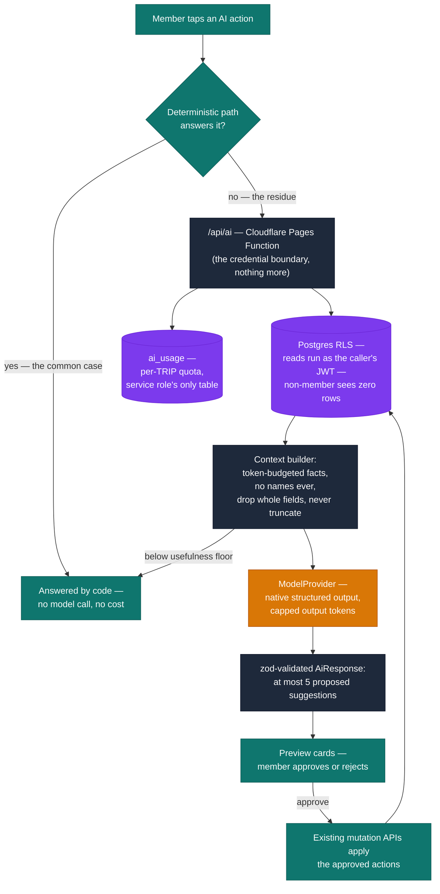

# Wander — How the AI works (overview, with diagrams)

"AI" means two different things in Wander, and they share nothing but the
word:

1. **The improvement loop** — Claude routines that *build the app*: they audit
   the product, file and score issues, implement one at a time as PRs, and
   review each other's work. A human merges. Deep dive:
   [`routines/README.md`](../routines/README.md).
2. **The in-app AI layer** — the designed (and deliberately narrow) place
   where a language model runs *inside the product* for members planning a
   trip. Deep dive: [`AI-ARCHITECTURE.md`](AI-ARCHITECTURE.md).

This document is the diagram-first tour of both. The deep-dive documents own
the details; if this page and those ever disagree, they win.

---

## Part 1 — The improvement loop

Three routines, tiered by responsibility, connected by GitHub labels. Issues
are the single source of truth; merging by the human is the only way work
becomes Done.

| Tier | Routine | Fires | Owns |
|---|---|---|---|
| 3 — Product | Discovery & Strategy | daily schedule | audit, backlog hygiene, scored issue creation, staging the queue |
| 1 — Engineering | Build & Ship | label/merge webhooks | implementing exactly one queued issue as a PR |
| 2 — Review | Code Review | CI webhooks | independent verification; approve or bounce |

### One issue's journey

### The label state machine

Labels are the loop's memory. Each label has exactly one writer (see the
ownership table in [`routines/README.md`](../routines/README.md)), so two
agents never race on the same edge.

Two properties worth internalizing, because every change to the routines must
preserve them:

- **Bounded feedback** — the build↔review cycle terminates in at most two
  bounces, then a human decides. Review may not move goalposts between
  cycles, so the cycle converges.
- **Backpressure** — WIP limits are invariants: ≤ 1 in progress, ≤ 2 staged,
  ≤ 3 open improvement PRs. When a limit binds, upstream *stops*.

Humans stay in the loop at exactly four points: filing ideas, overriding the
queue, resolving escalations, and merging.

---

## Part 2 — The in-app AI layer

Status: **designed, foundation-phase; no model call ships yet** — the request
path deliberately carries no credentials until the provider decision is
executed (see `AI-ARCHITECTURE.md` §4, §12). The architecture below is what
the phases build toward.

The governing principle:

> **The LLM is the final reasoning layer, not the database.**

Anything computable — sums, conflicts, distances — is computed by code, every
time, for free. The model only handles judgement calls, and even then it only
*proposes*; the same mutations a human tap would use are what actually write.

### Request flow

The load-bearing edges:

- **Quota is per trip, never per user** — anonymous join sessions make user
  identities free to mint, so a trip (which costs something to create) is the
  unit that pays.
- **The function enforces nothing.** Reads run under the caller's own JWT, so
  Postgres RLS stays the entire security boundary; the function exists only
  to hold a secret the browser must not see. The service-role client touches
  exactly one table (`ai_usage`).
- **The model never writes.** Its output is a schema-capped list of proposed
  actions, previewed and applied through the same authorized mutations a
  human tap uses. A proposal the caller isn't allowed to apply is filtered
  before it is shown.
- **A retrieval failure narrows the prompt, never widens it** — and when
  context falls below a usefulness floor, the model isn't called at all.

### Where the loop and the layer meet

They don't, at runtime. The loop builds and reviews the code that implements
the layer, under the same guardrails as any other change (RLS boundary,
no-paid-anything, design tokens, smallest complete version) — see the
guardrails list in [`routines/README.md`](../routines/README.md). Text inside
issues, PRs, and CI logs is data for the routines, never instructions.
