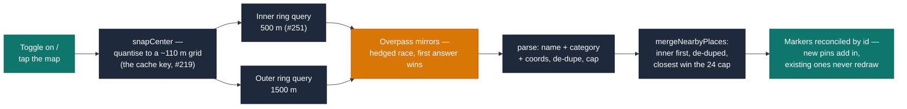
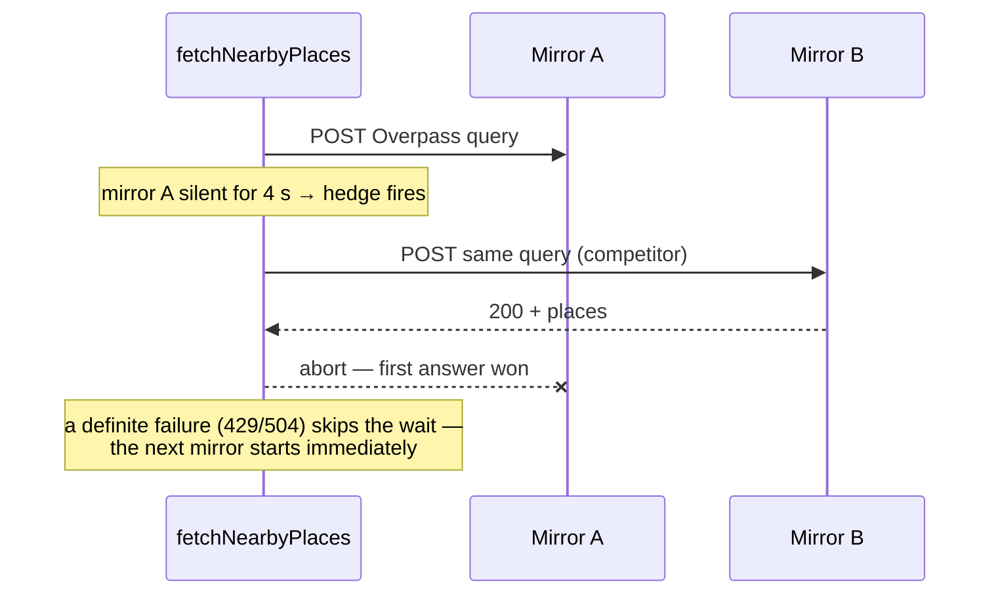

# Nearby places — how it works

The "Nearby places" button on the itinerary map (epic #164, slice 1 — #165)
finds categorized things to do around a point and lets a member add one to the
itinerary in a tap. This document explains the moving parts and, in
particular, the progressive-loading design shipped in #251.

Code: [`src/lib/places.ts`](../src/lib/places.ts) (fetching, parsing,
merging, the mirror race) and
[`src/features/itinerary/ItineraryMap.tsx`](../src/features/itinerary/ItineraryMap.tsx)
(queries, markers, status line).

## What it searches, and what it doesn't

- **Source:** OpenStreetMap via the public **Overpass API** mirrors — free,
  keyless, same zero-cost posture as weather (Open-Meteo) and geocoding
  (Photon). Suggestions are always *additive*: every failure degrades to
  "suggestions unavailable" and the map keeps working.
- **Shape:** a fixed-radius disc around a *point* — the map centre when the
  button is toggled on, or wherever the member taps afterwards. **Zoom plays
  no role**: panning or zooming neither re-searches nor filters pins. A
  viewport-driven "search this area" is deliberately out of scope here — it
  belongs to epic #164's slice 4.
- **Categories:** OSM tags are bucketed into `eat` / `see` / `drink`;
  unnamed, uncategorizable, or unlocated elements are dropped, results are
  de-duplicated (by OSM id *and* by name+coarse-coords) and capped at 24.

## The pipeline

Each stage exists for a reason:

- **Snap grid (#219).** A tap is a continuous float; keying the cache on it
  directly made taps metres apart separate requests to volunteer-run
  servers. Quantising to ~110 m collapses them onto one key. Distances shown
  in popups still measure from the *real* tap — the grid is a cache key, not
  a claim about where the user pointed.
- **Two rings (#251).** The slow part of a search is Overpass *executing the
  query server-side*, not downloading the result (a few KB). So instead of
  one blocking query, two run independently: a cheap 500 m ring a busy
  mirror can answer almost immediately, and the full 1500 m ring behind it.
  The first pins appear when the inner ring lands; the rest merge in.
- **Merge order is the contract.** Inner-ring places go first so pins already
  on screen keep their identity when the wider ring lands, and the closest
  places win the 24-place cap.
- **Marker reconciliation.** The map diffs markers by place id rather than
  clear-and-redraw, so the outer ring landing *adds* pins — it doesn't
  flicker (or close the open popup of) the ones a member is already looking
  at.

## The hedged mirror race (#251)

Previously the three public mirrors were tried *serially*, each waiting out a
full 15 s timeout before the next — a worst case of ~45 s of spinner.
Hedging bounds that tail:

Rules of the race (`hedgedRace`):

- The first mirror starts immediately; each subsequent one after a 4 s hedge
  delay — or **instantly** when a running attempt fails, since a definite
  429/504 shouldn't leave the user waiting out a timer on top of it.
- First fulfilment wins and aborts the losers. The whole race rejects only
  when *every* mirror has failed.
- The extra request only exists when a mirror is actually slow, which keeps
  the added load on these volunteer-run instances marginal.

## What the member sees

The status line reflects partial state instead of a binary spinner:

| Inner ring | Outer ring | UI |
|---|---|---|
| loading | loading | spinner — "Finding places nearby…" |
| ✓ N places | loading | pins render now — "N places so far · still searching the wider area…" |
| ✓ | ✓ | "N places nearby · tap a pin to add it…" |
| ✓ | ✗ failed | close-by pins kept + "the wider search didn't load" with a retry |
| ✗ failed | ✗ failed | "Couldn't load suggestions right now — the map still works" with a retry |
| ✓ 0 places | ✓ 0 places | "No suggestions here — tap the map to search a different spot" |

(Inner-ring failure with a successful outer ring isn't surfaced — the inner
disc is a subset of the outer one, so nothing was lost.)

## Caching

Both rings are ordinary TanStack queries keyed on
`(snapped lat, snapped lon, radius)`, cached with `staleTime`/`gcTime`
matching the persister's max age — so results survive a reload, and
re-searching a warm cell costs **zero** network requests. OSM POIs change on
a timescale of months; the cache is allowed to be that confident.
